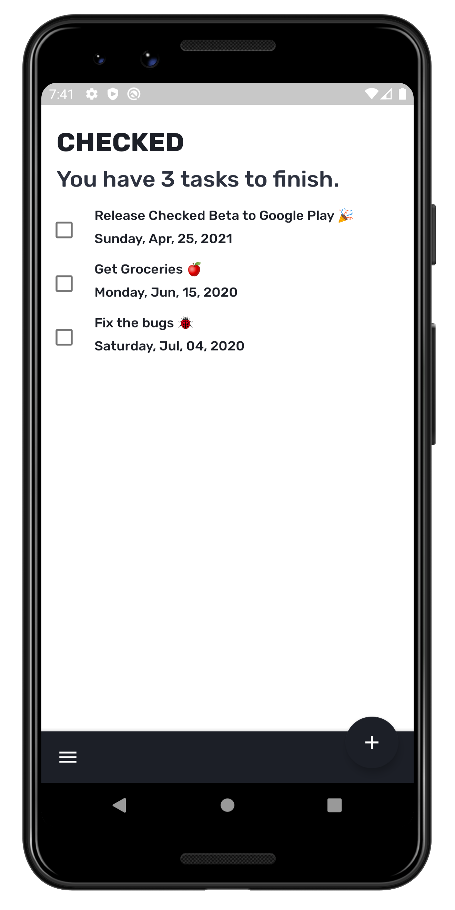
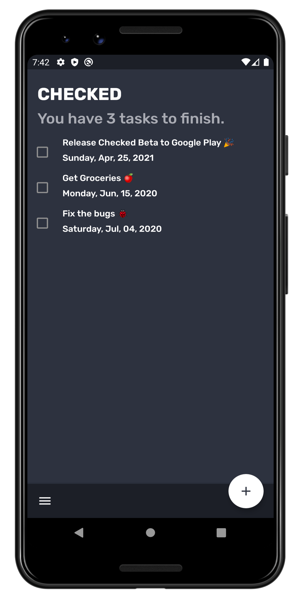
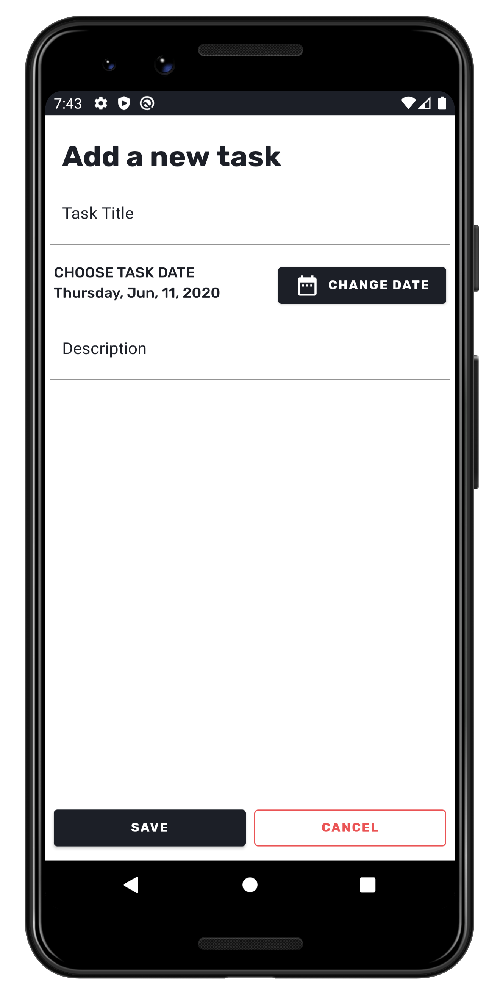

# To-Do Android App
### A Minimalistic Android Todo app written in Kotlin
#### Kotlin, Room Database and Repository, Material Components, MVVM

Screenshots
---

  
  
  

Current Features
---
* Add and manage tasks
* Overview of all your tasks at a glance
* Set task due dates 
* Beautiful Material design and interface
* Dark Mode (Toggle Coming soon)
* Works offline, all data stored on your device
* Your Privacy is secured

Planned Features
---
* Task notifications
* Multiple Task Lists
* Task Priority
* Task Tags
* Dark Mode Toggle/Settings Menu
* Overview customization
* Localization
* Themes - maybe

Known Issues
---
None

Help with Translating
---
Email me at margsglobal@gmail.com to help with translating the app.

